# GEO 太陽電池パネル 1年熱解析

静止軌道（GEO）3軸制御衛星の太陽電池パネルについて、**1ノード・両面放射モデル**で1年間の温度トレンドを算出します。

> **インタラクティブ版:** [docs/README.html](docs/README.html) — β角・南北面パネル・日食の統合SVGアニメ + 補助 Canvas アニメ。元ネタ: [Claude 共有解説](https://claude.ai/share/a4bbe0cb-92a6-45de-91d7-35c2304f047a)

本 README では、**温度の求め方**を手順ごとに解説し、各段階に対応するグラフを引用します。  
幾何・β角・日食の概念図は [Claude 共有解説](https://claude.ai/share/a4bbe0cb-92a6-45de-91d7-35c2304f047a) をベースに `docs/images/guide01–08` として再現しています。

---

## 温度の求め方（概要）

パネルを1つの温度ノードとみなし、真空宇宙での **熱平衡（日射時）** と **日食中の放射冷却** を組み合わせて年間トレンドを求めます。

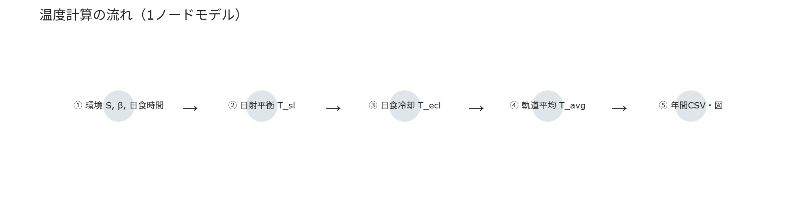

| ステップ | 内容 | 対応グラフ |
|---------|------|-----------|
| 幾何・環境 | 黄道/赤道、β角、日食条件 | guide01–05, fig08–fig11 |
| パネル入射 | 南北面パネルと cos(β) | guide08, fig03 |
| 発電効率 η | 10% / 20% / 28% 比較 | guide06–07, fig12–fig13 |
| ①–④ 計算 | $T_\mathrm{sl}$, $T_\mathrm{ecl}$, $T_\mathrm{avg}$ | fig01, fig05–fig07, fig14 |

詳細な式は [docs/THERMAL_MODEL.md](docs/THERMAL_MODEL.md) を参照してください。

---

## 黄道面・赤道面と季節

GEO 衛星は **赤道面**（= 軌道面）上を周回します。一方、地球の公転は **黄道面** 上で行われ、地軸は黄道面法線に対して **23.45°** 傾いています。この傾きが、季節と β角の年変動の根源です。

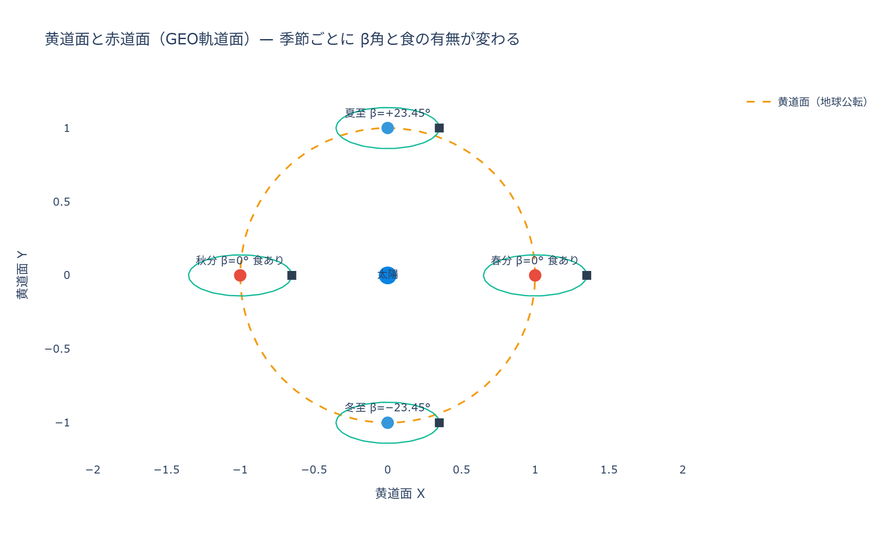

| 季節 | β角 | 日食 | 備考 |
|------|-----|------|------|
| 春分・秋分 | ≈ 0° | **あり**（最大 72 min/日） | 太陽が赤道面内 |
| 夏至 | ≈ +23.45° | なし | 全日照 |
| 冬至 | ≈ −23.45° | なし | 全日照 |

地軸の傾きが **0°** だった場合、β は通年 0° のままとなり、GEO では **毎日食** になります（下図の青破線）。

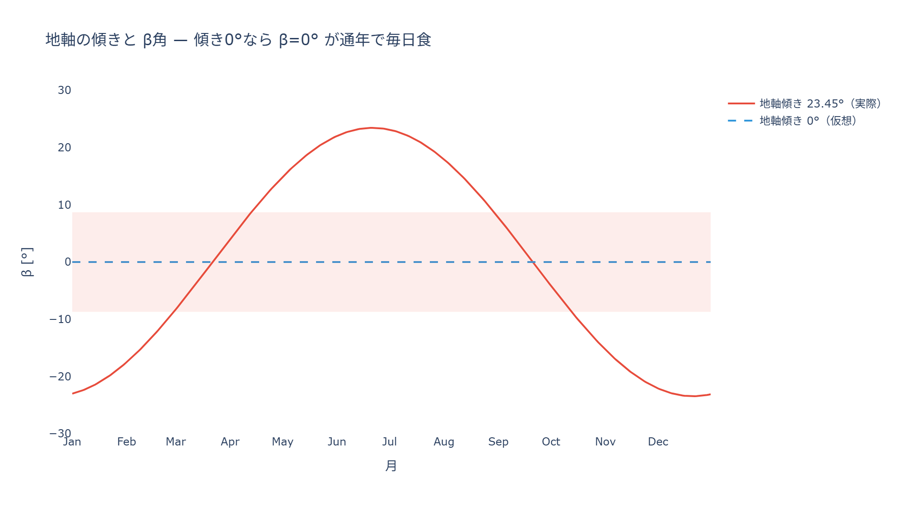

---

## β角 — 定義と物理的意味

**β角**は、太陽方向ベクトルと **衛星の軌道面**（GEO では赤道面）のなす角です。赤道周回軌道では **太陽赤緯 δ と一致** します。

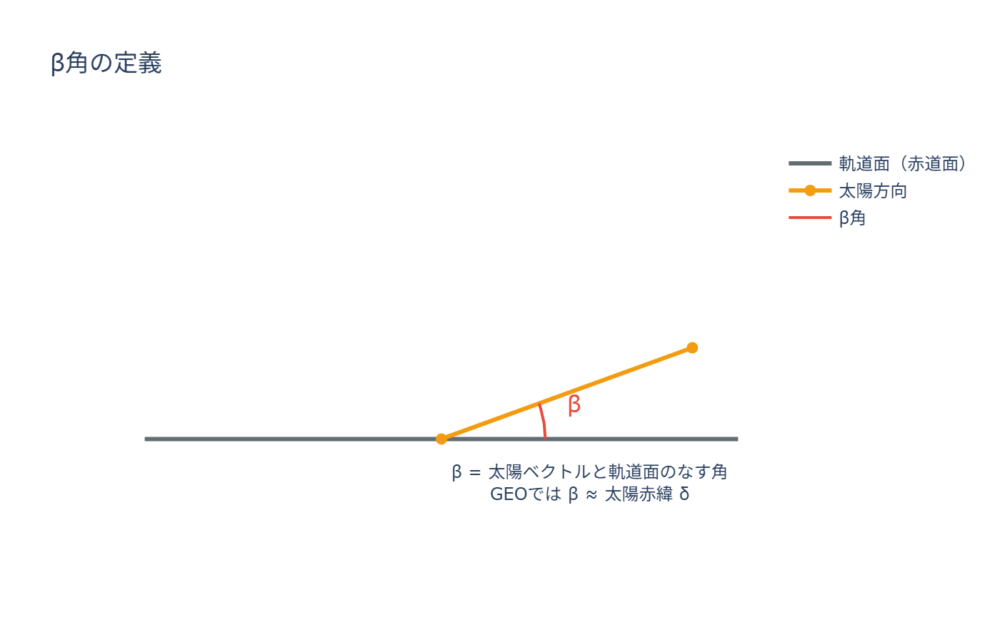

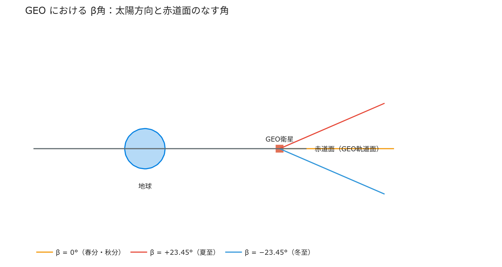

- 春分・秋分（$\beta \approx 0°$）… 太陽が赤道面内。GEO から見た太陽高度が年間で最も「軌道面に近い」時期。
- 夏至・冬至（$|\beta| \approx 23.45°$）… 太陽が軌道面から最大に傾く。

### 日食が起きる条件

GEO で地球本影に入るには、太陽が軌道面付近にある必要があります。地球角半径から、概ね **|β| < 8.7°** のとき日食が可能です。

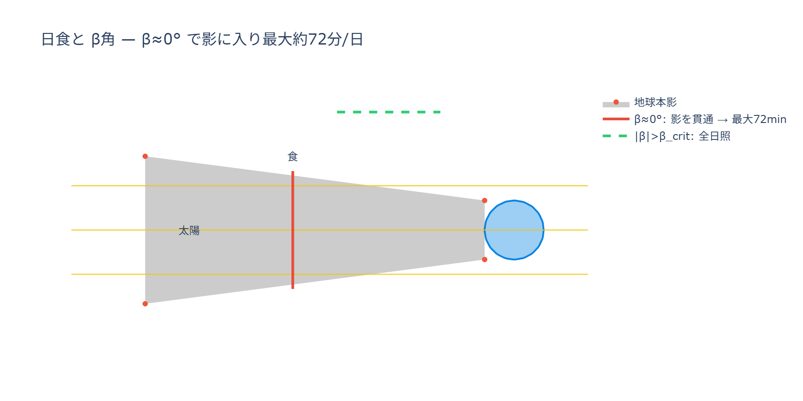

β ≈ 0° のとき衛星軌道が地球本影を貫通し、**最大約 72 分/日** の日食が発生します。|β| が大きいと影の上を通過し、全日照となります。

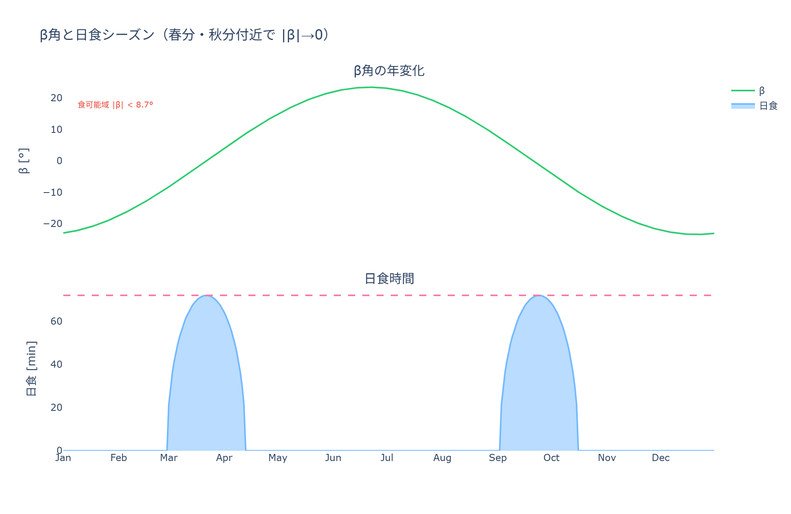

|β| と日食時間の関係を1年分で見ると、日食は **|β| が小さい日** に集中していることが分かります。

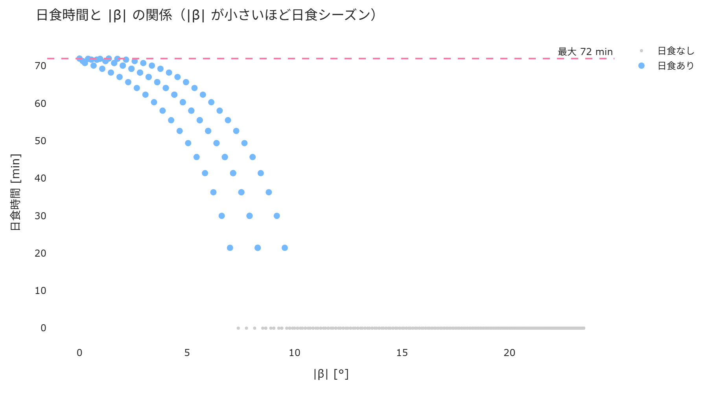

日食モデル（解析用近似）:


$$
t_\mathrm{ecl}(d) = \max\left(t_\mathrm{spring}(d-81),\; t_\mathrm{autumn}(d-267)\right), \quad t_\mathrm{max}=72\;\mathrm{min}
$$


春シーズン・秋シーズンそれぞれ約44日幅で、equinox を中心に日食時間が増加します。

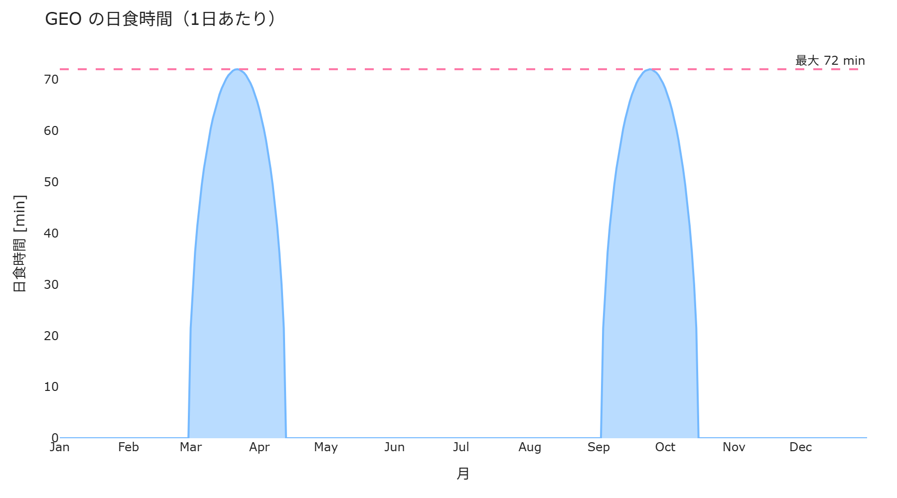

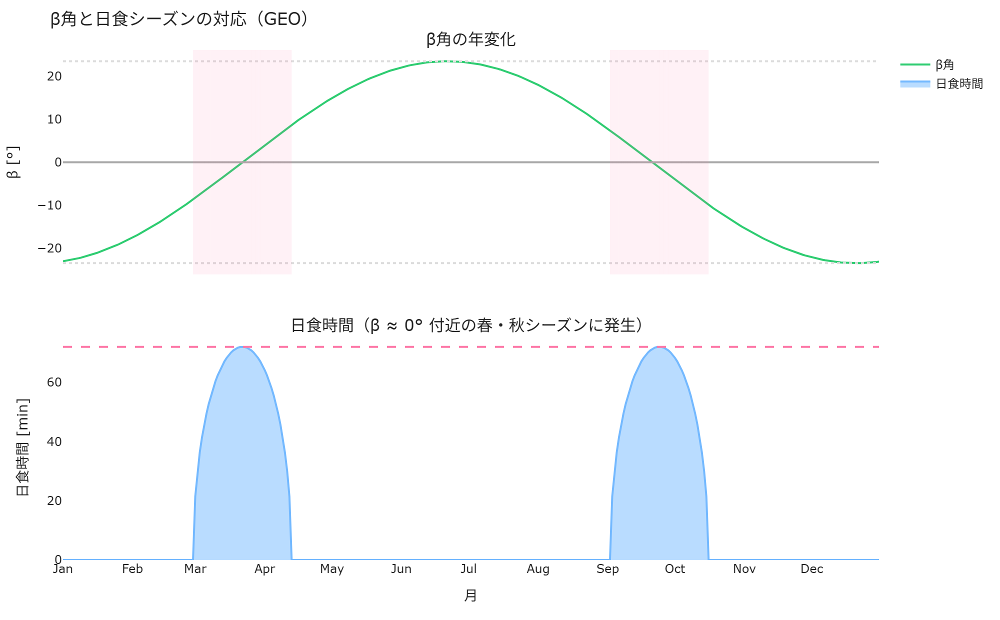

---

## 南北面パネルと入射角

パドル駆動の **南北面（N/S）パネル** は、季節の β を SADM で追従しますが、1日の東西運動は残るため、入射角 θ も別途評価します。

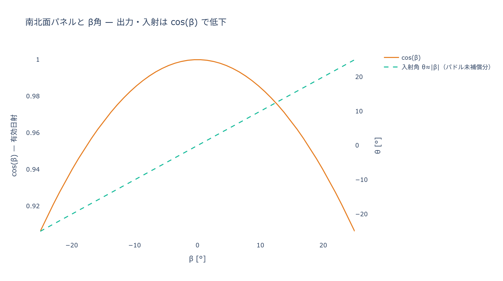

- **有効日射** … $S_\mathrm{eff} = S \cos\beta$（夏至・冬至でも cos(23.45°) ≈ 0.917）
- **入射角** … パドル未補償分として $\theta \approx |\beta|$ 程度


本プロジェクトのデフォルトモデルでは、日射平衡に **$S(d)$ をそのまま** 用いています。β 補正版 $S_\mathrm{eff} = S\cos\beta$ は感度解析のオプションとして `geo_panel_model.py` で拡張可能です。

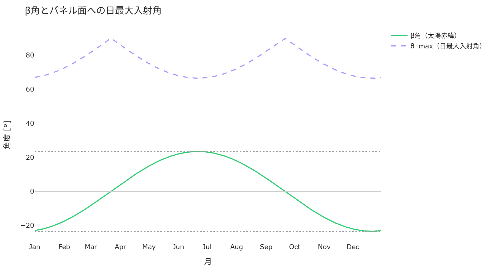

---

## 季節による太陽光の変化

人工衛星熱設計で季節変動の主因になるのは次の2つです。

| 要因 | 物理原因 | 影響する量 |
|------|----------|-----------|
| 日心距離 | 地球の公転（離心率） | 太陽フラックス $S$ |
| 公転軸の傾き | 地軸傾斜 23.45° | β角（太陽赤緯） |

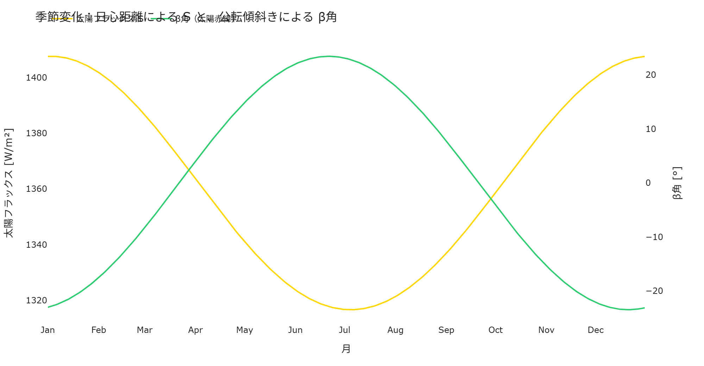

- **$S(d)$** … 1月に大きく、7月に小さく（±約3%）。$T_\mathrm{sl} \propto S^{1/4}$ のため、夏冬のわずかな差にも反応します。
- **$\beta(d)$** … 夏至で $+23.45°$、冬至で $-23.45°$、春分・秋分で $0°$。GEO の幾何・日食のタイミングを支配します。

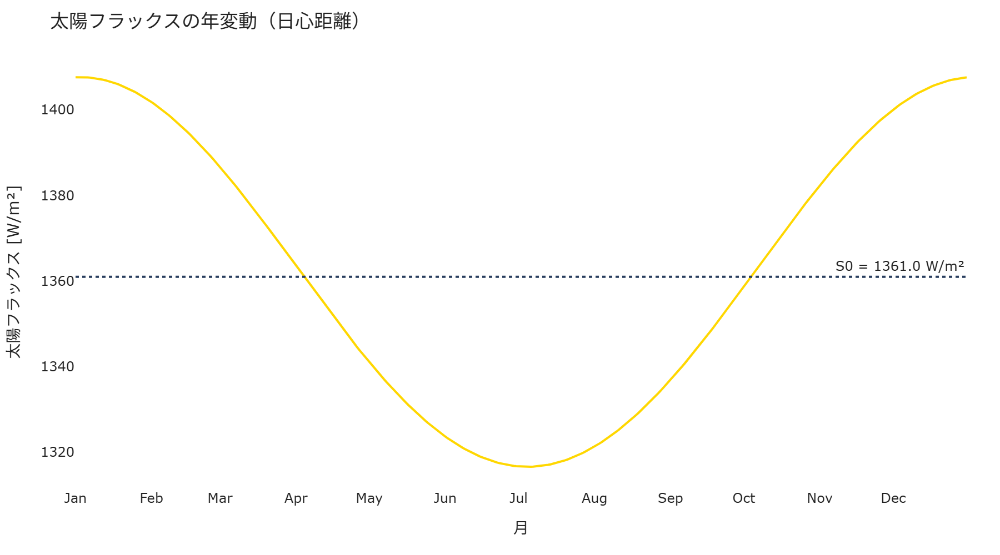

---

## 温度プロファイルの導出


年間の温度プロファイル（$T_\mathrm{sl}(d)$、$T_\mathrm{ecl}(d)$、$T_\mathrm{avg}(d)$）は、**環境の季節変化**から日ごとの熱入力を決め、**平衡・過渡**を解いて積み上げたものです。

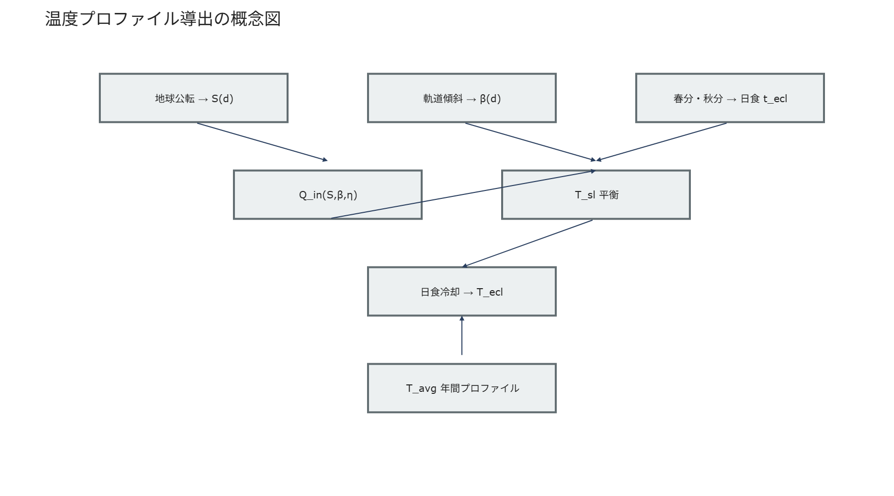

1. **環境** … 太陽フラックス $S(d)$、β角 $\beta(d)$、日食時間 $t_\mathrm{ecl}(d)$
2. **日射平衡** … 各日の $T_\mathrm{sl}(d)$（発電効率 $\eta_\mathrm{EOL}$ で吸収熱が変わる）
3. **日食冷却** … 各日の $T_\mathrm{ecl}(d)$
4. **軌道平均** … $T_\mathrm{avg}(d)$ で1日を代表化し、365日分が **年間温度プロファイル**

---

## ④ 日射平衡温度 $T_\mathrm{sl}$

日食のない区間で、パネル前面・背面が宇宙へ放射する **両面放射** モデルとして、定常熱平衡を解きます。

**熱の入力（W）**

| 項 | 式 |
|----|-----|
| 日射吸収 | $\alpha_s (1-\eta_\mathrm{EOL}) S A_\mathrm{front}$ |
| 地球赤外 | $\varepsilon_\mathrm{back} \sigma T_\mathrm{earth}^4 F_E A_\mathrm{back}$ |
| アルベド | $\alpha_s S \rho_\mathrm{alb} F_E A_\mathrm{front}$ |

**熱の出力**（表裏で放射率を分離）

$$
Q_\mathrm{rad} = \sigma \left(\varepsilon_\mathrm{front} A_\mathrm{front} + \varepsilon_\mathrm{back} A_\mathrm{back}\right) T^4
$$

**平衡温度**（$A_\mathrm{front}=A_\mathrm{back}$ のとき、日射のみの近似）

$$
\alpha_s (1-\eta_\mathrm{EOL}) S A = (\varepsilon_\mathrm{front} + \varepsilon_\mathrm{back}) \sigma T^4
$$

一般形（地球 IR・アルベドを含む）:

$$
T_\mathrm{sl} = \left(\frac{Q_\mathrm{solar}+Q_\mathrm{IR}+Q_\mathrm{alb}}{\sigma\left(\varepsilon_\mathrm{front} A_\mathrm{front}+\varepsilon_\mathrm{back} A_\mathrm{back}\right)}\right)^{1/4}
$$


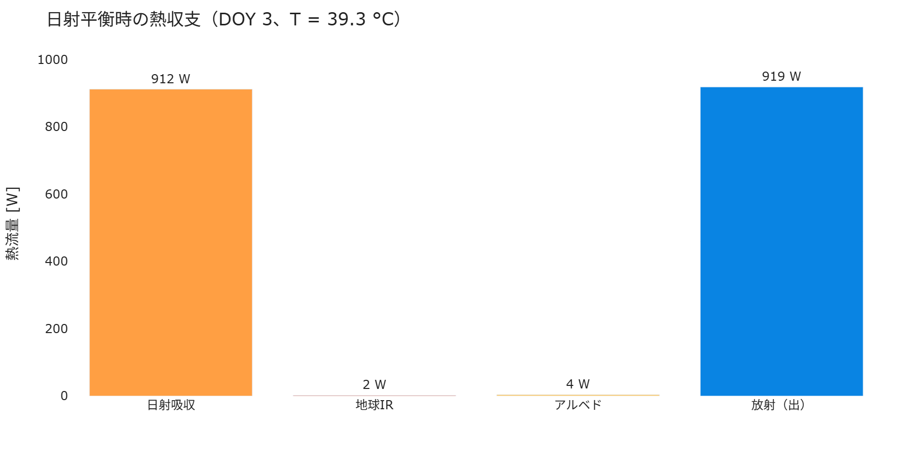


上図は DOY 3（1月初旬）の例です。日射吸収が主な熱源であり、地球 IR・アルベドも加わったうえで、前面・背面からの放射と平衡します。本設定では **約 35〜40°C** 程度の $T_\mathrm{sl}$ となります。

| パラメータ | 記号 | デフォルト |
|-----------|------|-----------|
| 太陽吸収率 | $\alpha_s$ | 0.90 |
| 前面放射率（カバーガラス） | $\varepsilon_\mathrm{front}$ | 0.85 |
| 裏面放射率（CFRP） | $\varepsilon_\mathrm{back}$ | 0.82 |
| 終期変換効率 | $\eta_\mathrm{EOL}$ | 0.28 |
| パネル熱容量 | $m C_p$ | 800 J/K |

---

## ⑤ 日食最低温度 $T_\mathrm{ecl}$

日食中は日射・地球 IR・アルベドをゼロとし、蓄熱したパネルが **放射のみ** で冷却します。


$$
m C_p \frac{dT}{dt} = -\sigma \left(\varepsilon_\mathrm{front} A_\mathrm{front} + \varepsilon_\mathrm{back} A_\mathrm{back}\right) T^4
$$

日食時間 $t_\mathrm{ecl}$ について数値積分（例: $\Delta t = 10$ s）し、日食開始直前の $T_\mathrm{sl}$ から最低温度を求めます。

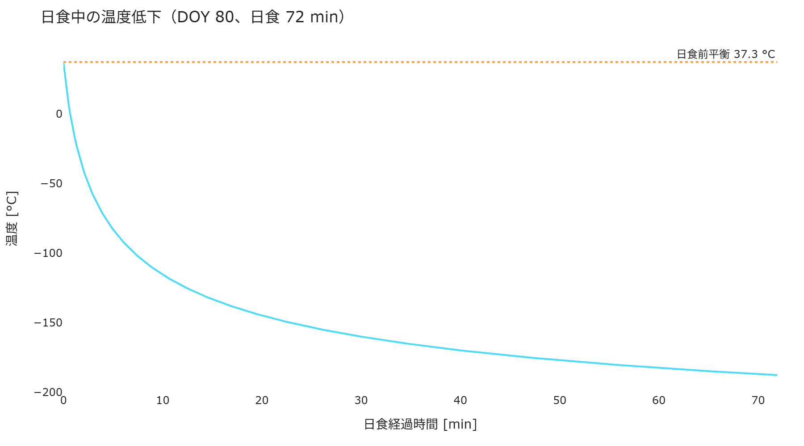

日食シーズンでは **数十分** で **−100°C 以下** まで下がり得ます（熱容量・放射率に依存）。本モデルでは最冷で約 **−188°C** 程度（秋の日食シーズン）です。

---

## ⑥ 軌道平均温度 $T_\mathrm{avg}$

1日のうち、日食時間割合 $f = t_\mathrm{ecl}/86400$ を考慮し、放射の4乗平均で代表温度を定義します。


$$
T_\mathrm{avg} = \left[(1-f) T_\mathrm{sl}^4 + f T_\mathrm{ecl}^4\right]^{1/4}
$$


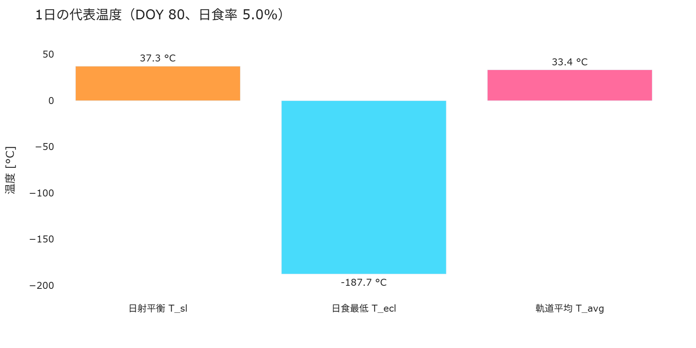


日食のない日は $T_\mathrm{avg} \approx T_\mathrm{sl}$。日食シーズンでは $T_\mathrm{ecl}$ の影響で軌道平均が下がります。

---

## 発電効率 $\eta_\mathrm{EOL}$ と温度プロファイル

日射平衡では、セルが熱に変える割合は **吸収日射の $(1-\eta_\mathrm{EOL})$ 倍** です。発電効率が高いほど廃熱が少なく、**$T_\mathrm{sl}$ は低下**します。

$$
Q_\mathrm{solar} = \alpha_s (1-\eta_\mathrm{EOL})\, S\, A_\mathrm{front}
$$

### 1軌道（約24 h）の温度プロファイル

春分付近の代表日（72 分日食）で、η = 10 / 20 / 28% の1軌道温度を比較します。効率が低いほど日射平衡温度が高く、日食前の蓄熱も大きいため、冷却開始温度も高くなります。

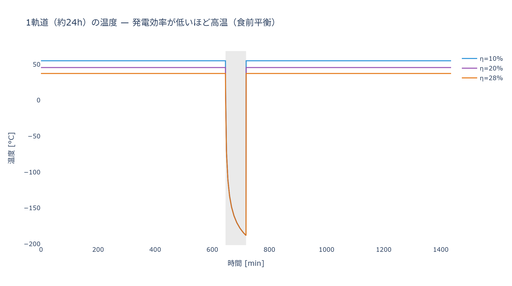

### 年間 $T_\mathrm{sl}$ の比較

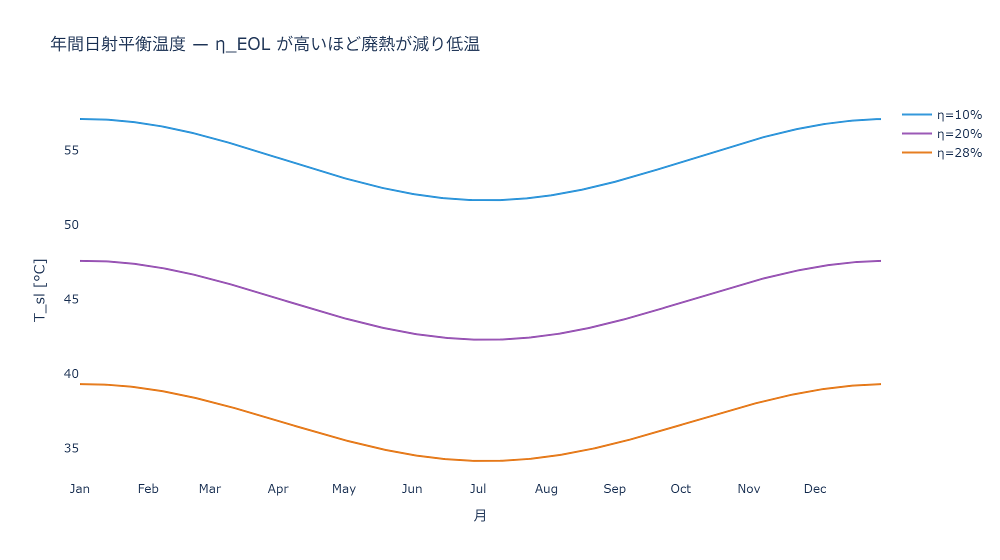

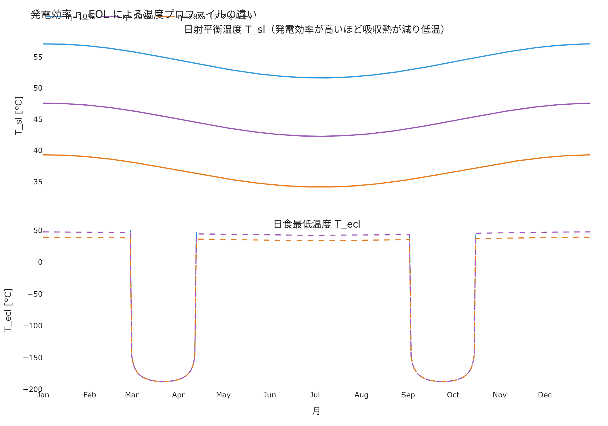

| $\eta_\mathrm{EOL}$ | $T_\mathrm{sl}$ の傾向 | $T_\mathrm{ecl}$ |
|----------------------|-------------------------|-------------------|
| 10% | 最も高温（廃熱大） | 日食前 $T_\mathrm{sl}$ が高い分、冷却開始温度も高い |
| 20% | 中間 | 同左 |
| 28%（デフォルト） | 最も低温 | 本プロジェクトの基準 |

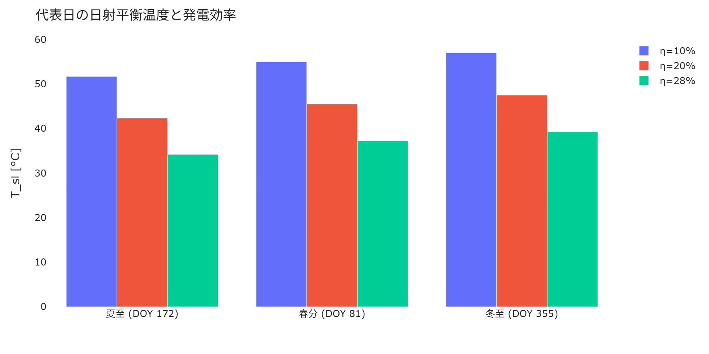

`config/default_panel.yaml` の `thermal.eta_eol` を変更するか、コード上で `run_annual_model(config, eta_eol=0.10)` のように指定して感度解析できます。

---

## ⑦ 年間温度トレンド

上記を1年分（DOY 1〜365）繰り返すと、次の3曲線が得られます。

| 曲線 | 意味 |
|------|------|
| 日射平衡（橙） | 各日の $T_\mathrm{sl}$ |
| 日食最低（青破線） | 各日の $T_\mathrm{ecl}$ |
| 軌道平均（赤点線） | 各日の $T_\mathrm{avg}$ |

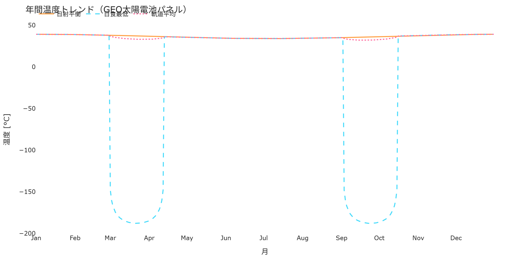

シミュレーション実行時は、上記に加えて日食時間・β角・太陽フラックスを含む **4パネル総合図** も `output/yearly_temperature_timeseries.png` として出力されます。

**読み方の要点**

- **橙線**は設計上の高温側目安（約 35〜40°C）。
- **青破線**は日食シーズンに急落し、年間最低温を与える。
- **春分・秋分付近**（灰帯）が日食シーズンで、最低温・軌道平均の低下が顕著。

---

## 環境入力の式（参照）

### 太陽フラックス $S$


$$
S(d) = \frac{S_0}{\mathrm{AU}(d)^2}, \quad
\mathrm{AU}(d) = 1 - 0.01671\cos\frac{2\pi(d-3)}{365.25}
$$


1月初旬（近日点付近）で最大、7月初旬（遠日点付近）で最小となります。

### β角と入射角


$$
\theta_\mathrm{max} = \arcsin|\cos\delta|
$$


---

## セットアップ

```bash
conda env create -f environment.yml
conda activate geo-panel-thermal
```

## 実行

```bash
# 年間シミュレーション + 総合図
python scripts/run_yearly_simulation.py --config config/default_panel.yaml

# CSV から図のみ再生成
python scripts/run_yearly_simulation.py --plot-only

# README 用の解説図（fig00–fig14 + guide01–08）を再生成
python scripts/generate_readme_figures.py

# 検証
python scripts/validate.py
```

## 出力ファイル

| ファイル | 内容 |
|---------|------|
| `output/daily_temperature_trend.csv` | 日次：S, β, 日食, $T_\mathrm{sl}$, $T_\mathrm{ecl}$, $T_\mathrm{avg}$ |
| `output/monthly_trend.csv` | 月次統計 |
| `output/yearly_temperature_timeseries.png` | 4パネル総合図 |
| `docs/images/fig00–fig14.png` | 温度計算・季節・η感度の解説図 |
| `docs/images/guide01–08.png` | 幾何・β角・日食・パネル入射の概念図 |
| `docs/README.html` | **インタラクティブ解説**（アニメーション + 静止画） |

## プロジェクト構成

```
src/
  constants.py
  config_loader.py
  geo_panel_model.py   # 温度計算コア
  plotting.py          # 総合年間図
  readme_figures.py    # fig00–fig14 解説図
  guide_figures.py     # guide01–08 概念図（Claude共有解説ベース）
  simulation.py
scripts/
  run_yearly_simulation.py   # シミュレーション / --plot-only
  generate_readme_figures.py # fig00–14 + guide01–08 一括生成
  validate.py
docs/
  THERMAL_MODEL.md
  README.html
  assets/              # readme.css, readme.js, beta_angle_solar_panels.*
  images/              # README 用図
config/
  default_panel.yaml
```

## 参考

- [docs/README.html](docs/README.html) — インタラクティブ解説（SVG / Canvas アニメーション）
- [Claude 共有解説 — β角・日食・効率感度の図解](https://claude.ai/share/a4bbe0cb-92a6-45de-91d7-35c2304f047a)
- [docs/THERMAL_MODEL.md](docs/THERMAL_MODEL.md) — 式・仮定の詳細
- ECSS-E-ST-31C / NASA SP-8105 / JAXA JERG-2-143A 等（宇宙機熱設計）