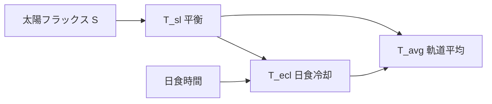

# GEO 太陽電池パネル熱解析モデル — 学習用解説

## 1. 問題設定

| 項目 | 設定 |
|------|------|
| 軌道 | 静止軌道（GEO） |
| 姿勢 | 3軸安定、南北面パドル駆動（年間平均は1ノードモデルで代表） |
| パネル | 宇宙用Si + カバーガラス + CFRP裏面 |
| 解析モデル | **1ノード・両面放射**（前面・背面が宇宙へ放射） |

本実装の年間トレンドは、ECSS / NASA 系の初期スクリーニング手法に沿った **平衡温度 + 日食過渡冷却** です（`src/geo_panel_model.py`）。

手順ごとの解説図付きの説明は [README.md](../README.md) を参照してください。図は `python scripts/generate_readme_figures.py` で `docs/images/` に生成されます。

---

## 2. 年間解析の考え方

GEOパネルの年間温度は次の3曲線で把握します。

1. **日射平衡温度** $T_\mathrm{sl}$ … 常時太陽光を受ける場合の定常温度  
2. **日食最低温度** $T_\mathrm{ecl}$ … 日食中に放射冷却だけで下がる最低温度  
3. **軌道平均温度** $T_\mathrm{avg}$ … 1日のうち日食時間割合で加重した代表温度  

---

## 3. 熱平衡（日射時）

### 3.1 入力熱

$$
Q_\mathrm{solar} = \alpha_s (1 - \eta_\mathrm{EOL}) S A_\mathrm{front}
$$

$$
Q_\mathrm{IR} = \varepsilon_\mathrm{back} \sigma T_\mathrm{earth}^4 F_E A_\mathrm{back}
$$

$$
Q_\mathrm{alb} = \alpha_s S \rho_\mathrm{alb} F_E A_\mathrm{front}
$$

- $\alpha_s$: 太陽吸収率（カバーガラス含む実効値）  
- $\varepsilon_\mathrm{front}$: 前面（カバーガラス）赤外放射率  
- $\varepsilon_\mathrm{back}$: 裏面（CFRP）赤外放射率  
- $\eta_\mathrm{EOL}$: 終期電気変換効率  
- $S$: 日射強度 [W/m²]  
- $F_E$: 地球からのビューファクタ  

### 3.2 出力熱（表裏分離・両面放射）

$$
Q_\mathrm{out} = \sigma \left(\varepsilon_\mathrm{front} A_\mathrm{front} + \varepsilon_\mathrm{back} A_\mathrm{back}\right) T^4
$$

### 3.3 平衡温度

$A_\mathrm{front}=A_\mathrm{back}$ かつ地球 IR・アルベドを無視した日射のみの近似:

$$
\alpha_s (1-\eta_\mathrm{EOL}) S = (\varepsilon_\mathrm{front} + \varepsilon_\mathrm{back}) \sigma T^4
$$

一般形:

$$
T_\mathrm{sl} = \left(\frac{Q_\mathrm{solar} + Q_\mathrm{IR} + Q_\mathrm{alb}}{\sigma\left(\varepsilon_\mathrm{front} A_\mathrm{front}+\varepsilon_\mathrm{back} A_\mathrm{back}\right)}\right)^{1/4}
$$

**デフォルト値**（`config/default_panel.yaml`）:

| パラメータ | 値 | 意味 |
|-----------|-----|------|
| $\alpha_s$ | 0.90 | 実効太陽吸収率 |
| $\varepsilon_\mathrm{front}$ | 0.85 | カバーガラス放射率 |
| $\varepsilon_\mathrm{back}$ | 0.82 | CFRP裏面放射率 |
| $\eta_\mathrm{EOL}$ | 0.28 | 終期変換効率 |
| $m C_p$ | 800 J/K | パネル熱容量 |
| $S_0$ | 1361 W/m² | 太陽定数 |

---

## 4. 日食最低温度

日食中は日射・地球IR・アルベドをゼロとし、放射のみで冷却:

$$
m C_p \frac{dT}{dt} = -\sigma \left(\varepsilon_\mathrm{front} A_\mathrm{front} + \varepsilon_\mathrm{back} A_\mathrm{back}\right) T^4
$$

日食時間 $t_\mathrm{ecl}$ について数値積分（デフォルト $\Delta t = 10$ s）し、$T_\mathrm{ecl}$ を求めます。

---

## 5. 軌道平均温度

$$
T_\mathrm{avg} = \left[(1-f) T_\mathrm{sl}^4 + f T_\mathrm{ecl}^4\right]^{1/4}
$$

$f = t_\mathrm{ecl} / 86400$ は日食時間割合です（放射平均）。

---

## 6. GEO日食時間

春分・秋分付近の2シーズンで、半値幅22日・最大72分の近似式を用います（`eclipse_duration_min`）。

$$
t_\mathrm{ecl}(d) = \max\left[t_\mathrm{spring}(d),\, t_\mathrm{autumn}(d)\right]
$$

---

## 7. β角（太陽光入射関連角）

### 7.1 β角（軌道面に対する太陽角）

GEO（赤道軌道）では、太陽ベクトルと軌道面（赤道面）のなす角 **β** は、太陽赤緯 $\delta$ と一致します（符号付き）。

$$
\beta \approx \delta = 23.45° \times \sin\left(\frac{360° (d - 81)}{365.25}\right)
$$

- 春分・秋分: $\beta \approx 0°$
- 夏至: $\beta \approx +23.45°$
- 冬至: $\beta \approx -23.45°$

### 7.2 パネル面への入射角 $\theta$

南北面パネル＋東西軸パドル（季節の赤緯を追従）の場合、1日のうち東西方向の太陽運動は追従できないため、**日最大入射角** を次式で評価します。

$$
\theta_\mathrm{max} = \arcsin|\cos\delta|
パドルなし（法線が赤道面内）の場合は $\theta \approx |\beta|$ です。
$$

---

## 8. 太陽フラックスの季節変動

地球軌道離心率による変動:

$$
\frac{S}{S_0} = \frac{1}{\mathrm{AU}(d)^2}, \quad \mathrm{AU}(d) = 1 - 0.01671\cos\frac{2\pi(d-3)}{365.25}
$$

---

## 9. 参考規格・文献

- ECSS-E-ST-31C / ECSS-E-HB-31-01（熱制御一般・ハンドブック）  
- NASA SP-8105, NASA-CR-168219（太陽電池アレイ熱解析）  
- JAXA JERG-2-143A（宇宙用太陽電池アレイ設計標準）  
- Gilmore, *Spacecraft Thermal Control Handbook*  

---

## 10. 結果の読み方

- **橙線（Sunlit）**: 設計上限の目安（通常 35–40°C 付近）  
- **青破線（Eclipse min）**: 低温設計・コンタクター選定の目安（-100°C以下になりうる）  
- **赤点線（Orbital avg）**: 平均温度・材料疲労の参考  
- **中央パネル**: 日食シーズンの日食時間（最大約72分）  
- **第3パネル**: β角（緑）とパネル日最大入射角 $\theta_\mathrm{max}$（紫破線）
- **下パネル**: 太陽フラックスの年変動（±3%程度）  